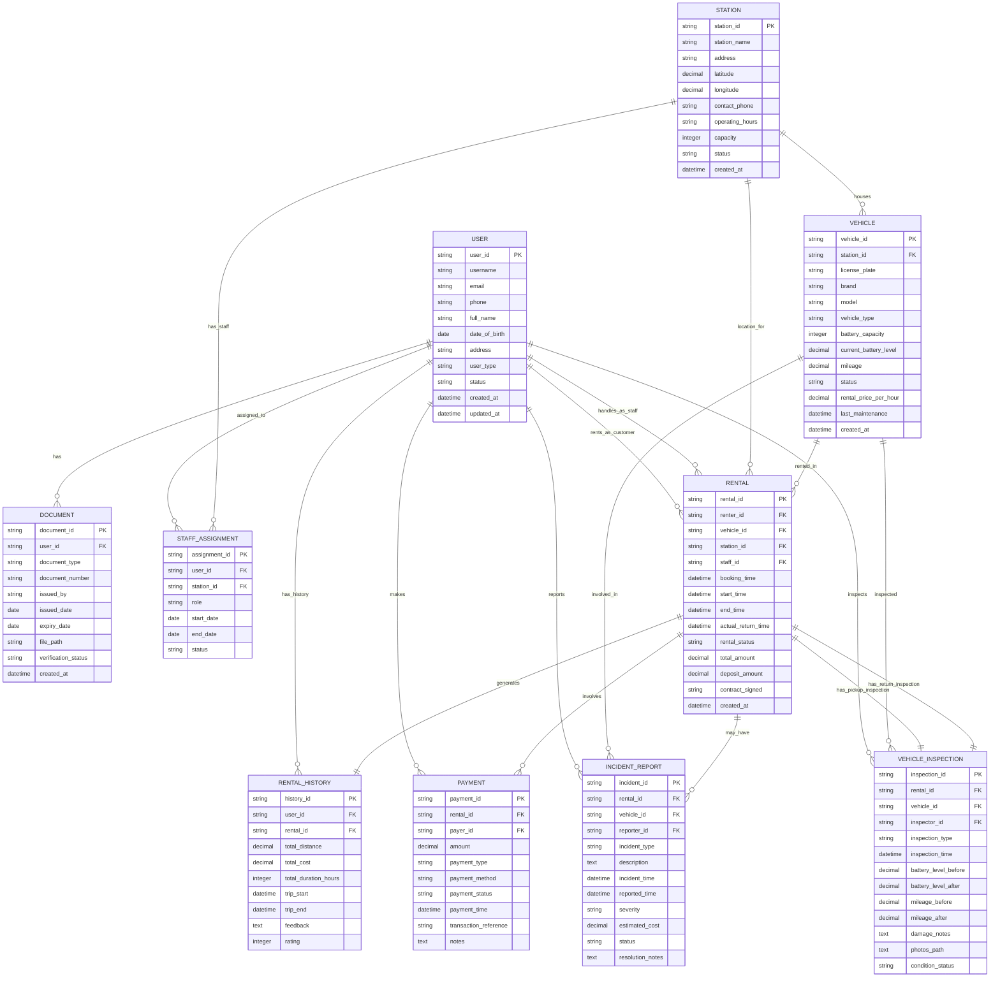

# Conceptual ERD - Hệ Thống Thuê Xe Điện (EV Rental System)

## Mô tả hệ thống
Hệ thống quản lý thuê xe điện với 3 nhóm người dùng chính:
- **EV Renter**: Người thuê xe
- **Station Staff**: Nhân viên tại điểm thuê  
- **Admin**: Quản trị viên hệ thống

## Conceptual ERD Diagram

## Mô tả các Entity chính

### 1. USER
- **Mục đích**: Lưu trữ thông tin tất cả người dùng trong hệ thống
- **Các loại**: EV Renter, Station Staff, Admin
- **Thuộc tính quan trọng**: user_type để phân biệt vai trò

### 2. DOCUMENT  
- **Mục đích**: Quản lý giấy tờ tùy thân, giấy phép lái xe
- **Liên kết**: Mỗi USER có thể có nhiều DOCUMENT
- **Xác thực**: verification_status để theo dõi trạng thái xác thực

### 3. STATION
- **Mục đích**: Quản lý các điểm thuê xe
- **Vị trí**: Có tọa độ GPS để hiển thị trên bản đồ
- **Capacity**: Số lượng xe tối đa có thể chứa

### 4. VEHICLE
- **Mục đích**: Quản lý đội xe điện
- **Trạng thái**: Available, Rented, Maintenance, Out_of_Service
- **Pin**: Theo dõi mức pin hiện tại và dung lượng

### 5. STAFF_ASSIGNMENT
- **Mục đích**: Quản lý việc phân công nhân viên tại các điểm
- **Linh hoạt**: Cho phép nhân viên làm việc tại nhiều điểm khác nhau

### 6. RENTAL
- **Mục đích**: Ghi nhận các giao dịch thuê xe
- **Quy trình**: Từ booking → start → end → return
- **Hợp đồng**: contract_signed để xác nhận ký hợp đồng điện tử

### 7. VEHICLE_INSPECTION
- **Mục đích**: Kiểm tra tình trạng xe khi giao và nhận
- **Loại**: Pickup inspection và Return inspection
- **Bằng chứng**: Lưu trữ ảnh chụp tình trạng xe

### 8. PAYMENT
- **Mục đích**: Quản lý các giao dịch thanh toán
- **Linh hoạt**: Hỗ trợ nhiều phương thức thanh toán
- **Loại**: Rental fee, Deposit, Refund, Penalty

### 9. INCIDENT_REPORT
- **Mục đích**: Ghi nhận sự cố, hư hỏng trong quá trình thuê
- **Theo dõi**: Từ báo cáo → xử lý → giải quyết
- **Chi phí**: Ước tính chi phí sửa chữa

### 10. RENTAL_HISTORY
- **Mục đích**: Lưu trữ lịch sử thuê xe của khách hàng
- **Phân tích**: Hỗ trợ báo cáo và phân tích hành vi khách hàng
- **Đánh giá**: Rating và feedback từ khách hàng

## Các mối quan hệ quan trọng

1. **USER - RENTAL**: Một người dùng có thể có nhiều lần thuê (1:N)
2. **VEHICLE - RENTAL**: Một xe có thể được thuê nhiều lần (1:N)  
3. **STATION - VEHICLE**: Một điểm có thể chứa nhiều xe (1:N)
4. **RENTAL - VEHICLE_INSPECTION**: Mỗi lần thuê có 2 lần kiểm tra (1:2)
5. **RENTAL - PAYMENT**: Một lần thuê có thể có nhiều khoản thanh toán (1:N)

## Lưu ý thiết kế

- **Flexibility**: Thiết kế linh hoạt để hỗ trợ mở rộng tương lai
- **Audit Trail**: Tất cả entity đều có timestamp để theo dõi
- **Status Management**: Sử dụng status fields để quản lý trạng thái
- **Data Integrity**: Sử dụng Foreign Keys để đảm bảo tính toàn vẹn dữ liệu